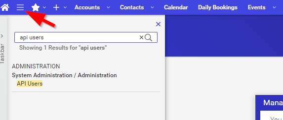
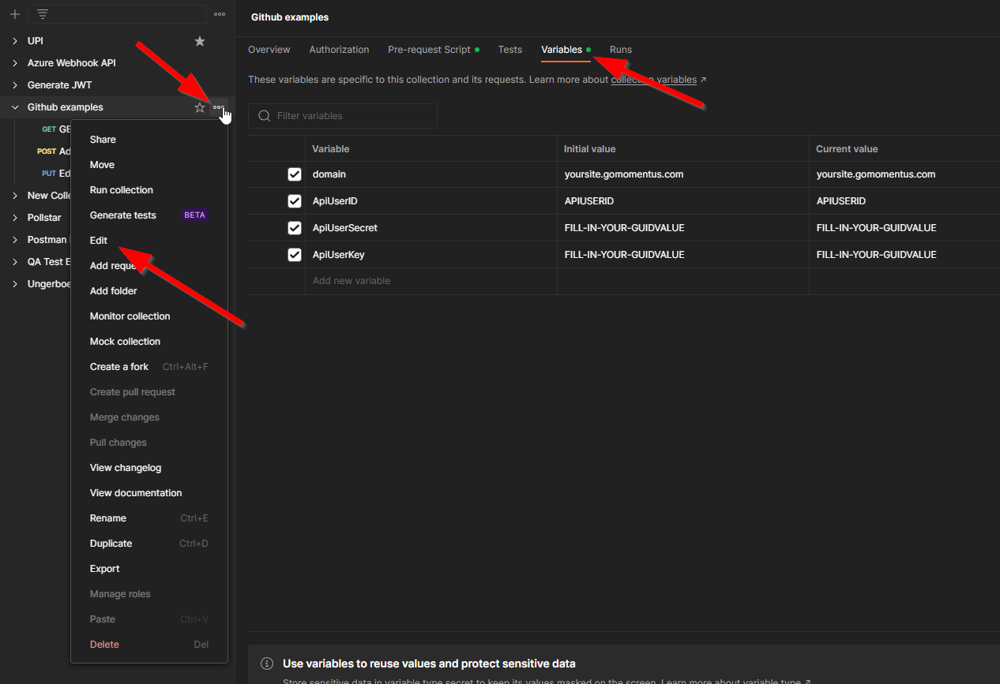
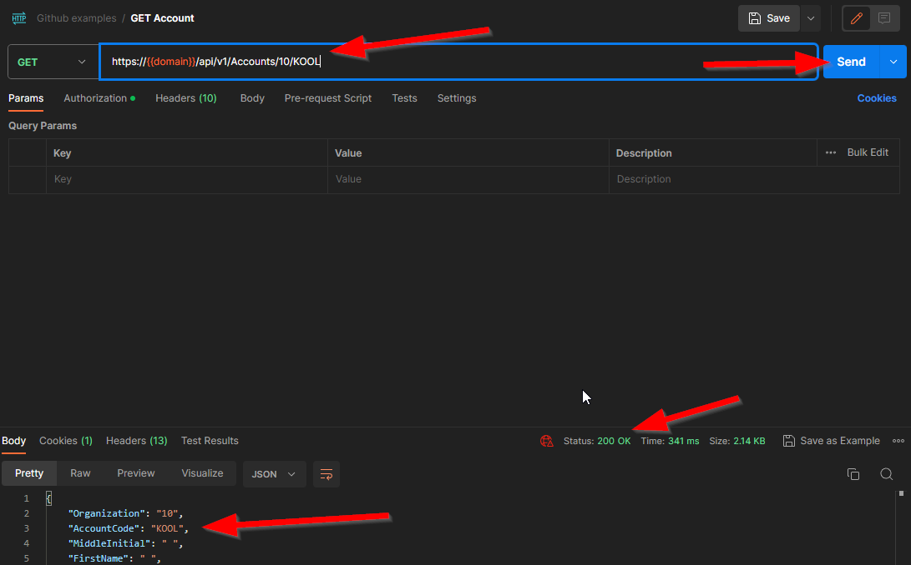

# How to use

1. Make an API User in Momentus Enterprise (Main Menu->API User-> Add)

2. Modify this Postman collection variables with your new Momentus API User information

3. Modify the endpoint URL to reflect an entry in your system. Example: for GET Account, swap out 10 and ACCTCODE for an actual account code in your Momentus

4. Hit send to try out one of the endpoints! The pre-request script tab for the collection contains example code that generates the JWT for the calls.